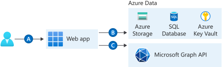

---
languages:
- csharp
- powershell
- html
page_type: sample
description: "Learn how to sign-in users to your web app, call Azure storage, and call Microsoft Graph."
products:
- azure
- azure-active-directory
- dotnet
- azure-storage
- aspnet
- ms-graph
---

# Tutorial: enable authentication in App Service, access storage, and call Microsoft Graph

A set of ASP.NET Core sample apps and tutorial that demonstrate how you can:

- (A) Configure authentication for a web app running on Azure App Service and limit access to users in your organization​.
- (B) Securely access Azure storage on behalf of the web application using managed identities​.
- (C) Access data in Microsoft Graph on behalf of the signed-in user​, or
- (C) Access data in Microsoft Graph on behalf of the web application using managed identities​.



Deploying a web app to Azure and configuring authentication is a pre-requisite to the other steps.  Accessing Azure storage using managed identities, accessing Microsoft Graph using managed identities, and accessing Microsoft Graph as the user are independent steps and can be done in any order.

These sample apps back the [Tutorial: enable authentication in App Service and access storage and Microsoft Graph](https://docs.microsoft.com/azure/app-service/scenario-secure-app-overview) articles on docs.microsoft.com.

## Configure authentication for a web app and limit access to users in your organization

If you are a Line of Business (LOB) developer, you'd probably want to only sign-in users in your organization with their work or school accounts. In this step, you learn how to enable the Azure App Service authentication/authorization module in Azure App Service, so you can sign in users and access data by writing minimal or no code in your web app.  This step is required and is done inline with the other steps.  Read [Add authentication to your web app running on Azure App Service](https://docs.microsoft.com/azure/app-service/scenario-secure-app-authentication-app-service) for more information.

## Securely access Azure storage on behalf of the web application using managed identities​

In this step, you configure authentication for a web app and [access Azure blob storage as the web app (using managed identities)](https://github.com/Azure-Samples/ms-identity-easyauth-dotnet-storage-graphapi/tree/main/1-WebApp-storage-managed-identity).  

You learn how to:
- Setup authentication for your web app.
- Display a "Hello user X" message using the [Microsoft.Identity.Web](https://aka.ms/microsoft-identity-web) library.
- Create a system-assigned managed identity on a web app.
- Access storage from a web app (on behalf of the app) by using managed identities

## Access data in Microsoft Graph on behalf of the signed-in user​

In this step, you configure authentication for a web app and [call Microsoft Graph from a secured app on behalf of the signed-in user](https://github.com/Azure-Samples/ms-identity-easyauth-dotnet-storage-graphapi/tree/main/2-WebApp-graphapi-on-behalf).

You learn how to:
- Setup authentication for your web app.
- Display a "Hello user X" message using the [Microsoft.Identity.Web](https://aka.ms/microsoft-identity-web) library.
- Grant delegated permissions to a web app.
- Call Microsoft Graph from a web app on behalf of the signed-in user.

## Access data in Microsoft Graph on behalf of the web application using managed identities​

In this step, you configure authentication for a web app and [call Microsoft Graph as the web app (using managed identities)](https://github.com/Azure-Samples/ms-identity-easyauth-dotnet-storage-graphapi/tree/main/3-WebApp-graphapi-managed-identity)

You learn how to:
- Setup authentication for your web app.
- Display a "Hello user X" message using the [Microsoft.Identity.Web](https://aka.ms/microsoft-identity-web) library.
- Create a system-assigned managed identity on a web app.
- Add Microsoft Graph API permissions to a managed identity.
- Call Microsoft Graph from a web app (on behalf of the app) by using managed identities.

## Getting Started

### Prerequisites

To run this sample, you'll need:
- [Visual Studio](https://visualstudio.microsoft.com/) for debugging or file editing
- [.NET Core 3.1](https://dotnet.microsoft.com/) or later
- An [Azure subscription](https://docs.microsoft.com/azure/guides/developer/azure-developer-guide#understanding-accounts-subscriptions-and-billing) and an [Azure AD tenant](https://docs.microsoft.com/azure/active-directory/develop/quickstart-create-new-tenant) with one or more user accounts in the directory

### Installation

Clone or download this repository. From your shell or command line:

```
git clone https://github.com/Azure-Samples/ms-identity-easyauth-dotnet-storage-graphapi.git
```

## Community Help and Support
Use [Stack Overflow](http://stackoverflow.com/questions/) with the community to provide support, using the tags `web app`, `asp.net core`. We highly recommend you ask your questions on Stack Overflow first and browse existing issues to see if someone has asked your question before.

If you find and bug in the sample, please raise the issue on [GitHub Issues](https://github.com/Azure-Samples/ms-identity-easyauth-dotnet-storage-graphapi/issues).

## Contributing
If you'd like to contribute to this sample, see [CONTRIBUTING.MD](CONTRIBUTING.md).

This project has adopted the [Microsoft Open Source Code of Conduct](https://opensource.microsoft.com/codeofconduct/). For more information, see the [Code of Conduct FAQ](https://opensource.microsoft.com/codeofconduct/faq/) or contact [opencode@microsoft.com](opencode@microsoft.com) with any additional questions or comments.
## Documentation

[Tutorial: enable authentication in App Service and access storage and Microsoft Graph](https://docs.microsoft.com/azure/app-service/scenario-secure-app-overview) articles on docs.microsoft.com.
